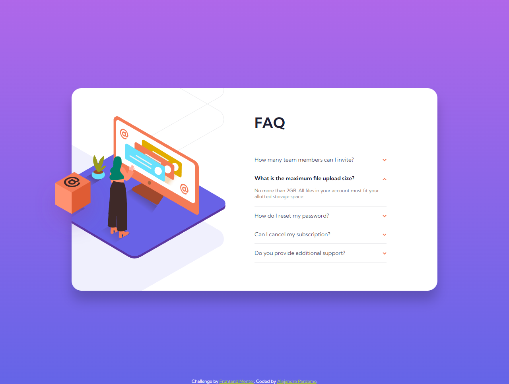

# Frontend Mentor - FAQ accordion card solution

This is a solution to the [FAQ accordion card challenge on Frontend Mentor](https://www.frontendmentor.io/challenges/faq-accordion-card-XlyjD0Oam). Frontend Mentor challenges help you improve your coding skills by building realistic projects.

## Table of contents

- [Overview](#overview)
  - [The challenge](#the-challenge)
  - [Screenshot](#screenshot)
  - [Links](#links)
- [My process](#my-process)
  - [Built with](#built-with)
  - [What I learned](#what-i-learned)
- [Author](#author)

## Overview

### The challenge

Users should be able to:

- View the optimal layout for the component depending on their device's screen size
- See hover states for all interactive elements on the page
- Hide/Show the answer to a question when the question is clicked

### Screenshot



### Links

- Solution URL: [Frontend Mentor Solution](https://www.frontendmentor.io/solutions/responsive-faq-accordion-component-using-flexbox-css-grid-and-js-YT3aAIFP5O)
- Live Site URL: [FAQ Accordion card](https://faq-accordion-alejandro.netlify.com)

## My process

### Built with

- Semantic HTML5 markup
- CSS custom properties
- Flexbox
- CSS Grid
- Desktop-first workflow
- JavaScript (ES6)

### What I learned

This was a really nice challenge and one that is starting to become a bit more difficult! I didn't implement the FAQ functionality through CSS because IMO using JS is more efficient and easier. I developed the following function for these kind of components:

```js
const toggleVisibility = (e) => {
  const click = e.target.parentElement.classList.contains("faq-item")
    ? e.target.parentElement
    : e.target;
  if (click.tagName !== "DIV") return;
  click.classList.toggle("open");
};
```

## Author

- Frontend Mentor - [@Cavalry2010](https://www.frontendmentor.io/profile/Cavalry2010)
- Twitter - [@AlPerdomoMC](https://www.twitter.com/AlPerdomoMC)
- GitHub - [@Cavalry2010](https://www.github.com/Cavalry2010)
